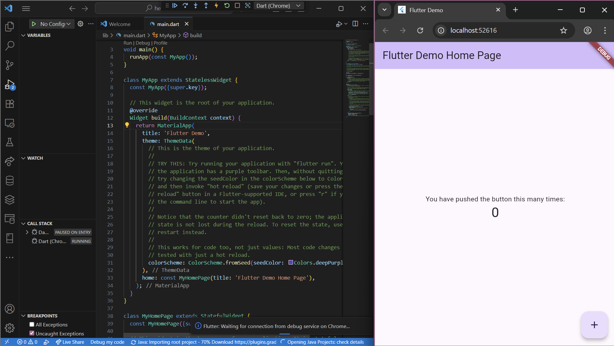
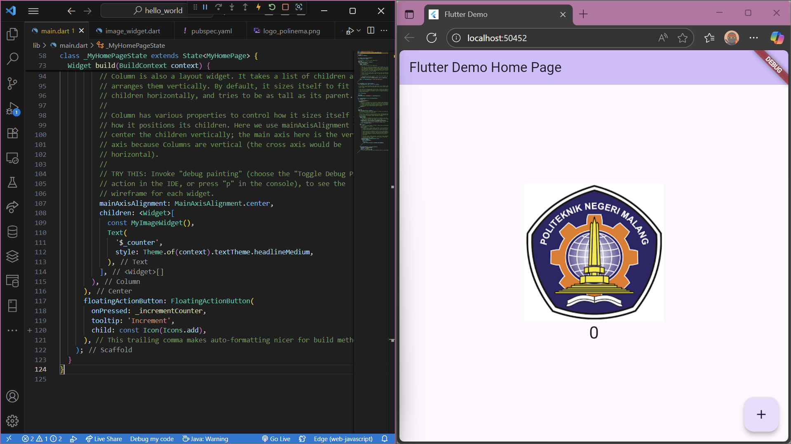
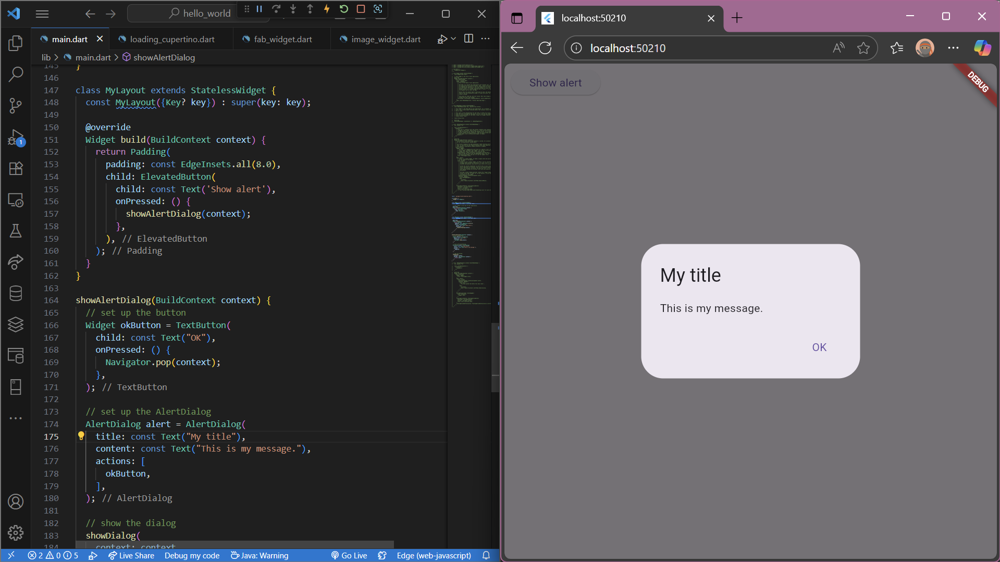
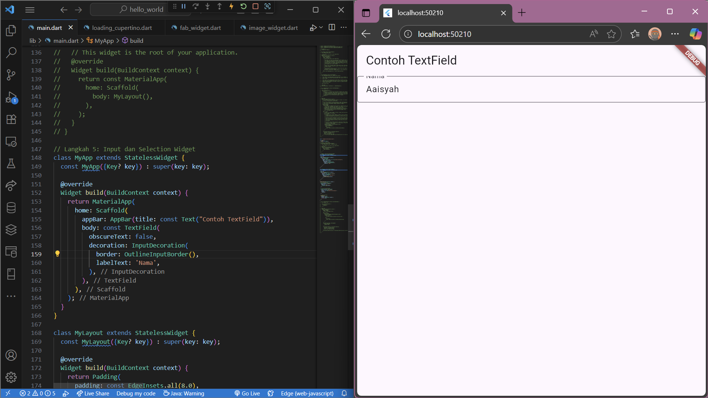
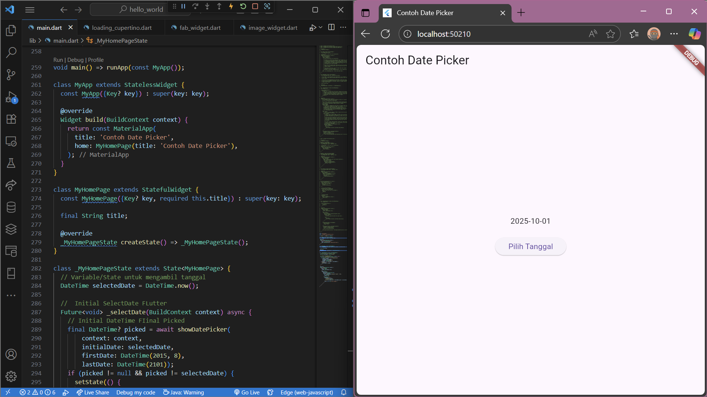
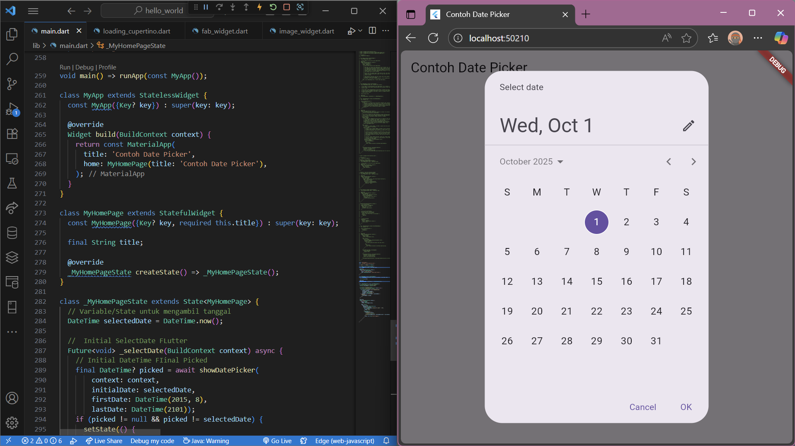

# Codelab 5 - Aplikasi Pertama dan Widget Dasar Flutter

Nama: Aaisyah Nursalsabiil  
NIM: 2341720171  
Kelas: TI - 3D

## Praktikum 1
Membuat project flutter

## Praktikum 2
Karena device tidak mendukung jadi pengujian dilakukan di chrome.  
  

## Praktikum 3
Sudah ada di github repositorinya.

## Praktikum 4
  
  

## Praktikum 5
  
  
  
  