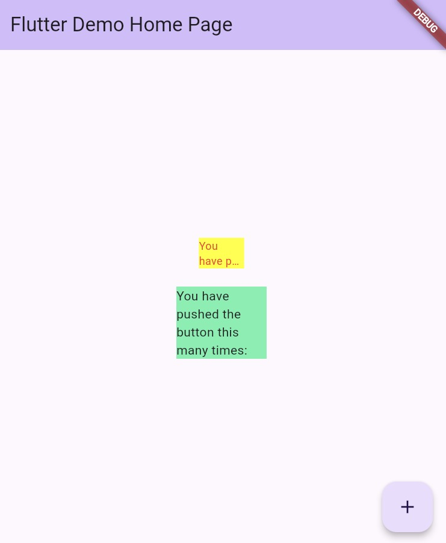

# CODELAB 06 - Layout dan Navigasi

Nama: Aaisyah Nursalsabiil N.P  
Kelas: TI - 3D  
NIM: 2341720171  

### Praktikum Menerapkan Plugin di Project Flutter

### SOAL
1. Jelaskan maksud dari langkah 2 pada praktikum tersebut!
2. Jelaskan maksud dari langkah 5 pada praktikum tersebut!
3. Pada langkah 6 terdapat dua widget yang ditambahkan, jelaskan fungsi dan perbedaannya!
4. Jelaskan maksud dari tiap parameter yang ada di dalam plugin auto_size_text berdasarkan tautan pada dokumentasi ini !

### Jawab
1. Langkah tersebut digunakan untuk menambahkan plugin auto_size_text pada project flutter 
2. Langkah ke 5 membuat widget RedTextWIdget menjadi reuseable dan dinamis, karena teks yang ditampilkan bisa diubah tanpa perlu mengedit widgetnya langsung 
3. pada widget pertama berfungsi untuk menampilkan teks yang menggunakan widget buatan sendiri yaitu RedTextWIdget, sedangkan pada widget kedua berfungsi untuk menampilkan teks menggunakan widget bawaan Flutter, yaitu Text. Perbedaan dari keduanya yaitu pada reusability, widget pertama bisa digunakan berulang dengan style konsisten, sedangkan widget kedua harus mengulang style setiap kali digunakan
4. Berikut adalah penjelasan dari parameter yang ada pada dokumentasi dart pada dart
- key: Mengatur identitas unik widget. Berguna agar Flutter tahu widget mana yang berubah saat rebuild.
- textKey: Key khusus untuk widget Text yang dihasilkan oleh AutoSizeText.
- style: Mengatur tampilan teks seperti warna, ukuran awal (fontSize), ketebalan, font family, dll.
- minFontSize: Ukuran font terkecil yang boleh digunakan saat teks diperkecil agar muat.
- maxFontSize: Ukuran font terbesar yang boleh digunakan.
- stepGranularity: Langkah pengurangan ukuran font saat menyesuaikan teks agar muat.
- presetFontSizes: Daftar ukuran font yang sudah ditentukan sebelumnya. AutoSizeText hanya akan mencoba ukuran dalam daftar ini.
- group: Digunakan untuk menyamakan ukuran font antar beberapa AutoSizeText.
- textAlign: Menentukan posisi teks secara horizontal (left, right, center, dll).
- textDirection: Menentukan arah teks, misal TextDirection.ltr (kiri ke kanan) atau rtl (kanan ke kiri).
- locale: Menentukan lokal bahasa agar karakter tampil sesuai gaya lokalnya.
- softWrap: Mengatur apakah teks boleh pindah baris otomatis jika panjang.
- wrapWords: Mengatur apakah kata panjang boleh dipotong ke baris berikutnya.
- overflow: Menentukan apa yang terjadi jika teks masih terlalu panjang (misalnya ellipsis, fade, clip).
- overflowReplacement: Widget pengganti jika teks tidak muat sama sekali
- textScaleFactor: Faktor skala teks (misalnya menyesuaikan dengan setting aksesibilitas pengguna).
- maxLines: Jumlah baris maksimum teks boleh tampil.
- semanticsLabel: Label alternatif untuk pembaca layar (accessibility).
